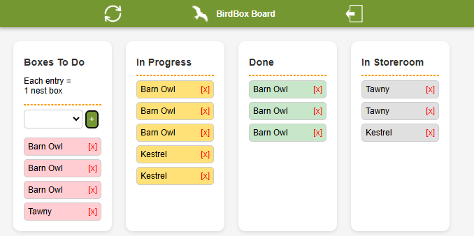

# Bird Box Kanban

Built to replace a whiteboard that was often obscured by tools, this is a proposed solution to enable the Bird Box Building Team at the Hawk Conservancy Trust communicate and manage the different types of nest boxes needed to support their conservation projects.

